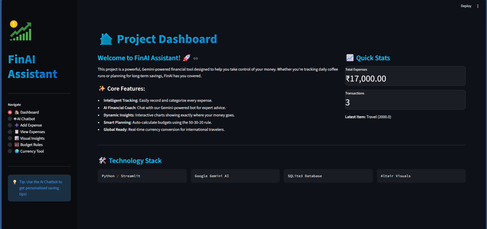

# 💰 FinAI Assistant - AI-Powered Budgeting & Financial Coach

FinAI is a premium, personal finance management tool built with **Streamlit** and powered by **Google's Gemini 2.5 Flash AI**. It combines traditional expense tracking with intelligent AI insights to help you master your finances.



## 🚀 Key Features

- **🏠 Interactive Dashboard**: Get a high-level overview of your financial health, including total spending and transaction counts.
- **🤖 AI Financial Coach**: A dedicated chatbot using Google Gemini to provide personalized saving tips, investment advice, and budgeting strategies.
- **➕ Smart Expense Logging**: Quick and easy form-based expense entry with categorization.
- **📊 Data Visualizations**: Beautiful, interactive charts (powered by Altair) to visualize your spending habits.
- **🧮 50-30-20 Planner**: Automated budget breakdown based on the popular financial rule.
- **🌍 Currency Tool**: Real-time currency conversion for your international financial needs.
- **📋 Export Ready**: Download your transaction history as a CSV file for external analysis.

## 🛠️ Technology Stack

- **Frontend**: Streamlit (with custom Glassmorphism CSS)
- **AI Engine**: Google Gemini 2.5 Flash
- **Database**: SQLite3
- **Visualization**: Altair & Pandas
- **APIs**: ExchangeRate-API (for currency conversion)

## 📂 Project Structure

```text
├── assets/
│   └── styles.css          # Custom premium styling
├── data/
│   └── expenses.db         # SQLite database (auto-generated)
├── app.py                  # Main Streamlit application
├── database.py             # Database CRUD operations
├── budget_logic.py         # Financial calculations & API logic
├── gemini_chat.py          # Gemini AI integration
├── charts.py               # Data visualization logic
├── prompts.py              # AI Persona & System prompts
└── requirements.txt        # Project dependencies
```

## 🛠️ Setup Instructions

1. **Clone the repository**:
   ```bash
   git clone https://github.com/Biswajeet111/Ai-Budgeting-Assistant.git
   cd Ai-Budgeting-Assistant
   ```

2. **Install Dependencies**:
   ```bash
   pip install -r requirements.txt
   ```

3. **Environment Setup**:
   Create a `.env` file in the root directory and add your API keys:
   ```env
   GEMINI_API_KEY=your_google_gemini_api_key
   EXCHANGE_API_KEY=your_exchangerate_api_key
   ```

4. **Run the App**:
   ```bash
   streamlit run app.py
   ```

## 🎨 UI/UX Design
The app features a modern **Glassmorphism** design with:
- Deep gradient backgrounds.
- Transparent, blurred card components.
- Interactive hover effects and transitions.
- Responsive layout for various devices.

## 🤝 Contributing
Feel free to fork this project and submit pull requests. For major changes, please open an issue first to discuss what you would like to change.

---
Built with ❤️ by [Biswajeet Kumar](https://github.com/Biswajeet111)